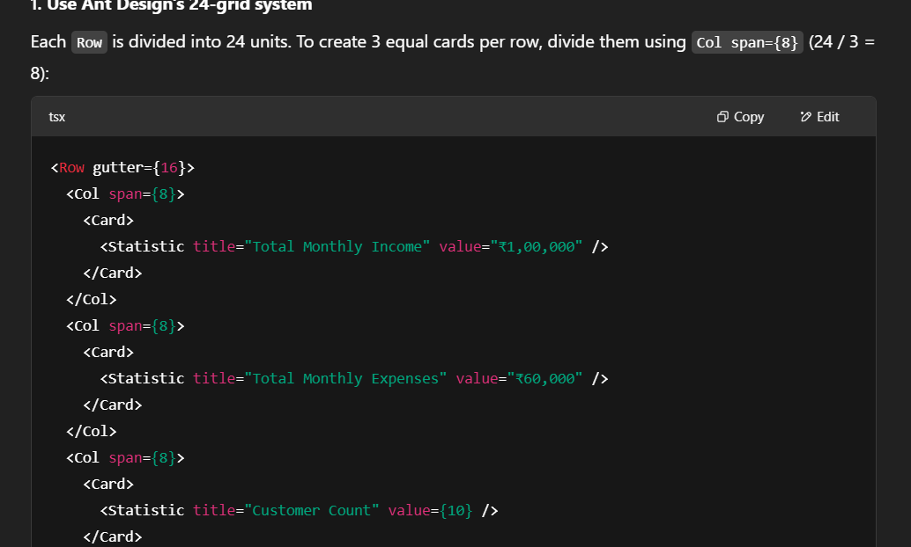

# Credit Risk Analytics Dashboard

## Setup Instructions

Follow the steps below to run this project locally.

### Prerequisites
Make sure you have the following installed on your machine:
- [Node.js](https://nodejs.org/) 
- [npm](https://www.npmjs.com/) or [Yarn](https://yarnpkg.com/)

### Steps

# Frontend(client)
1. Clone repository -> then,
   cd client

2. Install the dependencies:
   npm install

3. Run the development server:
   npm start

4. Open your browser and navigate to http://localhost:3000 to view the app.

# Backend(server)

1. Navigate to the backend directory:
   cd backend
2. Install backend dependencies:
   npm install
3. Start the backend server:
   npm start
4. The backend server will be running at http://localhost:5000.

## Risk Scoring Explanation

The risk score for each customer is calculated based on their financial behavior and credit-related metrics. The goal is to identify customers with potentially higher credit risk using a simple, weighted formula.

### Factors Considered:

- **Credit Score**: Reflects the customer’s creditworthiness. Higher credit scores reduce risk.
- **Loan Repayment History**: Percentage of timely repayments. More on-time payments reduce risk.
- **Outstanding Loans**: Total unpaid loans. Higher values increase risk.
- **Monthly Income**: Regular monthly earnings. Lower income increases risk when compared with loans.

### Calculation Logic:

The risk score is calculated out of 100 using the following formula:

- **Credit Score Contribution (50%)**:  
  `(creditScore / 850) * 50`

- **Repayment History Contribution (30%)**:  
  `onTimePaymentsRatio * 30`  
  where `onTimePaymentsRatio = onTimePayments / totalPayments`

- **Loan to Income Ratio Contribution (20%)**:  
  `(1 - (outstandingLoans / monthlyIncome)) * 20`  
  (Clamped between 0 and 1)

These components are added together to give a final score between **0 and 100**. After calculation, the score is rounded to 2 decimal places and clamped within the 0–100 range.

### Risk Level Categorization:

- **High Risk**: Score > 70
- **Medium Risk**: Score between 40 and 70
- **Low Risk**: Score ≤ 40

Each risk level is color-coded for visualization:
-  **Red** for High Risk
-  **Orange** for Medium Risk
-  **Green** for Low Risk

The full implementation of this logic can be found in the `RiskAssessment.calculateRiskScore()` function.
[AI Usage Screenshot](./public/Assets/ai-usage3.png)

# This project used AI (ChatGPT) for:

Implementing risk score logic

Risk Scoring Logic :	ChatGPT helped me craft and refine the formula.
UI/UX :	Helped apply consistent Ant Design components and make UI responsive.
## AI Tool Usage Screenshot

## Loom Video Walk-through 

To see a detailed walk-through of the application, watch the Loom video below:
 
https://www.loom.com/share/a38f4154715c4274912aaafe5e5cd860?sid=e3baf099-540e-4ce3-8496-9c15f53d8276

